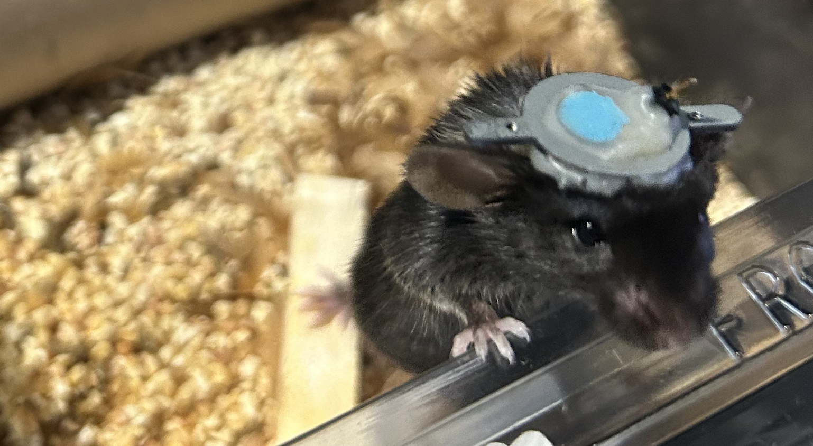
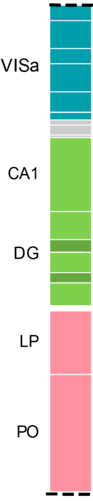
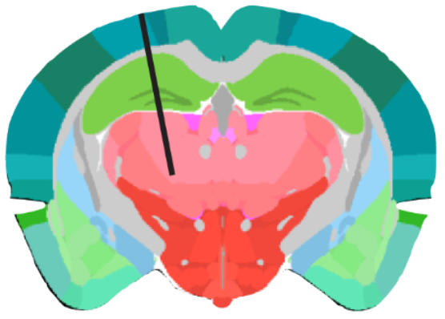

# Of mice and men - Or: How I learned to read spikes. An Introduction

 

 

_Image by Robin Haak, Netherlands Institute for Neuroscience (NiN), Amsterdam, NL_  
  
 

In spring 2023, I had the opportunity to do my internship as part of the [Resarch Master program Cognitive Neuroscience](https://www.universiteitleiden.nl/en/education/study-programmes/master/psychology-research/cognitive-neuroscience-research "https://www.universiteitleiden.nl/en/education/study-programmes/master/psychology-research/cognitive-neuroscience-research") at Dr Anne Urai’s Cognitive, computational and systems neuroscience - short: [CoCoSys lab](https://anneurai.net/ "https://anneurai.net/") at Leiden University in the Netherlands.
  
Anne is a very skilled and pationate researcher investigating “how the brain transforms sensory information into useful decisions, and how such decisions change with experience and internal states.” (CoCoSys lab). Age could be considered one of those “internal states”, with changes in neural variability, along with changes in other brain features. To investigate age-related neural changes on cellular and population level, Anne recorded electrophysiology data in aged mice during her postdoc times with the [International Brain Laboratory (IBL)](https://nationalbrainlab.com/#home "https://nationalbrainlab.com/#home"). She used Neuropixels probes to record from multiple brain regions at a time while the mice conducted a perceptual decision making task. Most of the preprocessing steps (e.g., spike sorting) where already completed for these data when I started my internship in February 2023. Just one step was missing for some files to make the data ready for anaylsese: the ephys alignments. That is, to align electrophysiology features of a recording to an anatomical histology reference (the [Allen adult mouse brain atlas](http://atlas.brain-map.org/atlas?atlas=602630314#atlas=602630314&structure=8&resolution=16.00&x=5700.845703125&y=4000.3232421875&zoom=-3&plate=576989980 "http://atlas.brain-map.org/atlas?atlas=602630314#atlas=602630314&structure=8&resolution=16.00&x=5700.845703125&y=4000.3232421875&zoom=-3&plate=576989980")) to allow for reasonable alignment of the recording channels along the probe trajectory. This is important since mouse brains might be smaller or larger, or slightly differ in some structural landmarks. Those ephys alignments are therefore a crucial prerequisite to ensure that subsequent analyses compare apples with apples, or, let’s say, spike count variability in a given region of one mouse with the spike count variability in exactly that same region in another mouse.
  
So, this made then the core of my internship: do the ephys alignments for the aged mice sessions recorded from the so-called _repeated site_ (IBL verbiage, referring to the brain regions involved in the [IBL reproducability study](https://www.biorxiv.org/content/10.1101/2022.05.09.491042v3 "https://www.biorxiv.org/content/10.1101/2022.05.09.491042v3")): Visual Area A (VISa); Hippocampal Field CA1; Dentate Gyrus (DG); Lateral Posterior nucleus of the thalamus (LP); Posterior nucleus of the thalamus (PO). 

 

_Figure 1. The regions of the mouse brain comprising the IBL repeated site, and probe trajectory projected onto a coronal view of the Allen adult mouse brain atlas. (Source: [IBL reproducability paper](https://www.biorxiv.org/content/10.1101/2022.05.09.491042v3 "https://www.biorxiv.org/content/10.1101/2022.05.09.491042v3"))_  

 

The following sections are a personal reflection on how I dove into the mystery of ephys features and spiking patterns related to the mouse brain anatomy. It consists of three parts:
 
- How I came to terms with the [IBL ephys alignment GUI](https://github.com/sonjafoerster/internshipNL2023/blob/main/01_OMM_Part_I.md)
- A personal account of my biggest learnings in the [Overall approach to ephys alignments](https://github.com/sonjafoerster/internshipNL2023/blob/main/02_OMM_Part_II.md)
- A somewhat more content-focused account of [Common ephys features in the mouse brain (IBL repeated site)](https://github.com/sonjafoerster/internshipNL2023/blob/main/03_OMM_Part_III.md) including my personal logbook of sanity check and handling the IBL ephys GUI.

 

By the way, if you’re interested about Anne’s research topics and [project ideas, have a look at her wiki page](https://anne-urai.github.io/lab_wiki/ProjectIdeas.html "https://anne-urai.github.io/lab_wiki/ProjectIdeas.html") and get in contact with her!

 

* * *
# Documentation of my alignment activities
Access for authorised folks only.
- [Overview spreadsheet](https://docs.google.com/spreadsheets/d/1Z6BIn8-febzvsmEHCao1rWnMz3n8eqJDbe5CdaDBW6Y/edit#gid=0 "https://docs.google.com/spreadsheets/d/1Z6BIn8-febzvsmEHCao1rWnMz3n8eqJDbe5CdaDBW6Y/edit#gid=0") with alignments I worked on
- [Meeting minutes](https://docs.google.com/document/d/1kSeMpFLyE7b1jlhkMHSh6eXPtOSA1Z53BPmDKWNYOgQ/edit#heading=h.3026quwoznbh "https://docs.google.com/document/d/1kSeMpFLyE7b1jlhkMHSh6eXPtOSA1Z53BPmDKWNYOgQ/edit#heading=h.3026quwoznbh") alignment meeting with Anup on 9 May 2023
- All files, including screenshots of tissue damage and potential noise artifacts are stored in this [gdrive folder](https://drive.google.com/drive/folders/1hTUZBVab2xnZGjZVqpY_9uH0P3CpDu8f "https://drive.google.com/drive/folders/1hTUZBVab2xnZGjZVqpY_9uH0P3CpDu8f")
  
 

* * *
# References
- [Anne’s github aged mice](https://github.com/anne-urai/mouse_aging "https://github.com/anne-urai/mouse_aging") project
- [CoCoSys lab](https://anneurai.net/ "https://anneurai.net/") home
- [Anne’s project ideas](https://anne-urai.github.io/lab_wiki/ProjectIdeas.html "https://anne-urai.github.io/lab_wiki/ProjectIdeas.html")
- [International Brain Laboratory](https://nationalbrainlab.com/#home "https://nationalbrainlab.com/#home") - IBL
- [IBL ephysatlas](https://ephysatlas.internationalbrainlab.org/ "https://ephysatlas.internationalbrainlab.org/")
- [Allen adult mouse brain atlas](http://atlas.brain-map.org/atlas?atlas=602630314#atlas=602630314&structure=8&resolution=16.00&x=5700.845703125&y=4000.3232421875&zoom=-3&plate=576989980 "http://atlas.brain-map.org/atlas?atlas=602630314#atlas=602630314&structure=8&resolution=16.00&x=5700.845703125&y=4000.3232421875&zoom=-3&plate=576989980")
- IBL paper on the repeated site and reproducability project - focus ephys measures: [Reproducibility of in-vivo electrophysiological measurements in mice (2022)](https://www.biorxiv.org/content/10.1101/2022.05.09.491042v3 "https://www.biorxiv.org/content/10.1101/2022.05.09.491042v3")