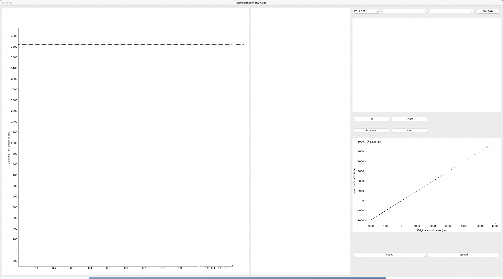
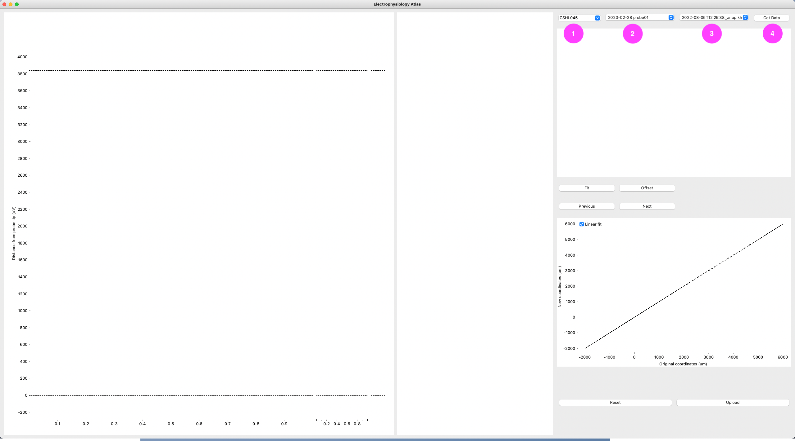

# Of mice and men - Part I: The IBL ephys alignment GUI
This post is the first of three parts of my personal reflections  [Of mice and men Or: How I learned to read spikes](https://github.com/sonjafoerster/internshipNL2023/blob/main/00_OMM_Intro.md). The other two parts are:
- A personal account of my biggest learnings in the [Overall approach to ephys alignments](https://github.com/sonjafoerster/internshipNL2023/blob/main/02_OMM_Part_II.md)
- A somewhat more content-focused account of [Common ephys features in the mouse brain (IBL repeated site)](https://github.com/sonjafoerster/internshipNL2023/blob/main/03_OMM_Part_III.md) including my personal logbook of sanity checks and handling the IBL ephys GUI.
  
Here, I will briefly introduce the IBL ephys alignment tool and provide some basic practicalities to get it up and running. This is mostly pulling together information from several github repos. It is therefore meant as a one-stop-shop to get started and to find more information as needed - plus some personal remarks.

</br>

# Introduction
The IBL ephys alignment software is a tool developed and maintained by the [International Brain Laboratory (IBL)](https://www.internationalbrainlab.com/#home-new "https://www.internationalbrainlab.com/#home-new"). The tool provides a graphical user interface (GUI) through which electrophysiological features recoreded from [Neuropixels](https://www.neuropixels.org/ "https://www.neuropixels.org/") probes can be aligned to anatomical histology landmarks. This allows to better locate the recording electrodes along the Neuropixels probe in the brain. Anatomical / histology reference for the alignments is the [Allen adult mouse brain atlas](http://atlas.brain-map.org/atlas?atlas=602630314#atlas=602630314&structure=8&resolution=16.00&x=5700.845703125&y=4000.3232421875&zoom=-3&plate=576989980 "http://atlas.brain-map.org/atlas?atlas=602630314#atlas=602630314&structure=8&resolution=16.00&x=5700.845703125&y=4000.3232421875&zoom=-3&plate=576989980") by the [Allen institute](https://alleninstitute.org/ "https://alleninstitute.org/"). (More information on this and other brain atlases by the Allen institue can be found [here](http://atlas.brain-map.org/ "http://atlas.brain-map.org/").) 
  
The ephys alignment tool provides a comprehensive visual representation of each session / insertion, including
- ephys features (e.g., spike counts, spike amplitude, power spectrum, cluster plots with unit properties);
- histology map based on Allen brain atlas reference with indication and visualization of  scaling factors for alignments;
- slice information, e.g., actual histology image of respective session with probe trajectory interpolation from LASAGNA;
- fit figure to represent the scaling along the depth of the probe trajectory.
  
With these design features, the GUI allows to visually inspect the quality of the recordings to assess for example drift, noise from recording channels, poor neural yield, or tissue damage at insertion site.  
  
The following sections will provide an introduction to and an overview of the ephys alignment tool GUI and its main features.
  
</br>

# Prereqs to launch the IBL ephys alignment tool
## Install unified IBL python environment
Before launching the software, make sure you have installed the unified IBL python environment (`iblenv`). 
Further, make sure to have installed the IBL repos `iblenv` (yes, same name, but no, not the same as the environment but a repo!)  and `iblapps`. Those repos would probably sit in a local working directory called something like `int-brain-lab`.
  
If the above is not installed or you run into issues, see [this github site](https://github.com/int-brain-lab/iblapps/wiki/1.-Installation "https://github.com/int-brain-lab/iblapps/wiki/1.-Installation") for the IBL instructions on how to install the unified IBL python environment.

</br>

## Keep environment up to date
The IBL repos / alignment tool GUI are under active development, thus, make sure you regularly pull the latest changes. For that, make sure the `⁠iblenv`⁠ environment is activated through running the below code in your terminal:
```
conda activate iblenv
```
  
Then, navigate to the `iblapps` and `iblenv` repos, pull the latest updates and update the requirements. 
In your terminal, if you are in your local working directory (probably something like `int-brain-lab`) you can run the following code:
```
cd iblapps
git pull
cd ..
cd iblenv
git pull
pip install --requirement requirements.txt --upgrade
```
  
If you encounter any errors, IBL recommends to remove the old installation and install a new one from scratch. Instructions can be found on the same [IBL github site](https://github.com/int-brain-lab/iblapps/wiki/1.-Installation "https://github.com/int-brain-lab/iblapps/wiki/1.-Installation") as mentioned above.

</br>

## You need credentials to launch the software
If you plan to work on IBL data, you need IBL credentials for both ONE and Datajoint.
- Instructions for setting up [ONE credentials](https://int-brain-lab.github.io/iblenv/one_docs/one_credentials.html "https://int-brain-lab.github.io/iblenv/one_docs/one_credentials.html")
- Instructions for setting up [Datajoint credentials](https://int-brain-lab.github.io/iblenv/dj_docs/dj_credentials.html "https://int-brain-lab.github.io/iblenv/dj_docs/dj_credentials.html")
  
More information on how to install the software tool for both IBL users and external users can be found on [this IBL github](https://github.com/int-brain-lab/iblapps/wiki/1.-Installation "https://github.com/int-brain-lab/iblapps/wiki/1.-Installation").

</br>

# Launching the ephys alignment software GUI
## Launch the tool
To launch the tool activate the unified IBL python environment (`iblenv`), then launch the tool through your terminal:
```
conda activate iblenv
# path to the ephys_atlas_gui.py file on your computer
python int-brain-lab/iblapps/atlaselectrophysiology/ephys_atlas_gui.py 
```
  
Depending on the local wifi connection, it might take some time for the software tool to load, keep an eye out on your terminal to watch the progress. When readily launched, you will see a GUI with empty plots - this is because no data file has been loaded yet. 

</br>

_Figure 1. IBL ephys alignment tool upon launch: empty plots, no data yet._  
  

</br>

## Load data
If you access the tool as an IBL user (i.e., using IBL ONE and Datajoint credentials), the tool will find available data or session files for which probe tracing is completed. To select a file, locate the dropdown menus in the upper right part of the GUI and select from left to right:
1. Subject name
2. Session date & probe
3. File (if no alignment available yet, there will be only one file: original; otherwise, all available alignments files will be displayed with their unique time stamp at time of alingment and the user ID who did the alignment).
Dropdowns 2 and 3 will be empty at first and only populate based on your selection in dropdown 1.
  
Finally, hit the _Get Data_ button to the right of the dropdowns (4) to load the selected data.

</br>

_Figure 2. Select data via the dropdown menus (upper right; 1 - 3) from left to right, then load data (4)._
   
  
It might take some time for the data to load, keep an eye out on your terminal to watch the progress.  

</br> 

# Feature overview GUI
For an excellent introduction to the GUI design and features, see the [IBL user guide](https://github.com/int-brain-lab/iblapps/wiki/2.-Usage-instructions "https://github.com/int-brain-lab/iblapps/wiki/2.-Usage-instructions").
  
</br>

# The IBL alignment (resolution) process
To ensure high quality of the alignments, the IBL introduced an alignment resolution process. It is mandatory to follow when working with IBL data. But I think it is a good guideline and QC measure to be applied to any project.
  
Basically, the alignment process requires that each session is aligned by two researchers independently. The alignments are automatically compared upon upload (as soon as there are more than two alignments submitted through the software GUI). If the alignment QC measure shows more than 80% agreement, the alignments are automatically resolved, and the channel positions will be automatically taken from the latest alignment. 
  
In case of less than 80% agreement between alignments, a resolution process needs to be initiated. In this case, the two researchers (optionally joined by experts) need to discuss their approaches. They can agree upon one alignment (in which case the other alignment can be re-done for automatic resolution through the tool, or the agreed upon alignment can be resolved manually). If no alignment seems feasible, the researchers can generate a new alignment which they agree upon, and manually resolve for that one. In case none of the above steps leads to a satisfactory solution, the case should be brought to the IBL Physiology Workgroup. You can find contact information on the [International Brain Lab (IBL) website](https://nationalbrainlab.com/#home "https://nationalbrainlab.com/#home").

</br>

# Troubleshooting
## General
Please find a list of [known problems and troubleshooting](https://github.com/int-brain-lab/iblapps/wiki/5.-Troubleshooting "https://github.com/int-brain-lab/iblapps/wiki/5.-Troubleshooting") in the respective section of the IBL user guide.
If you encounter other issues, please try first to update your enviornment as described [here](https://github.com/sonjafoerster/internshipNL2023/blob/main/01_OMM_Part_I.md#keep-environment-up-to-date). If the issue persists you can also
[open a ticket here](https://github.com/int-brain-lab/iblapps/issues "https://github.com/int-brain-lab/iblapps/issues"). Make sure to include a proper description to replicate the issue as well as the error message you got in the terminal.

</br>

## File does not load
There are many reasons why a file might not load properly. This may even happen if the data was successfully loaded before. In such a case, try whether deleting the session folder and reloading the data solves the issue: Locate the folder with the respective subject name in your ONE folder (probably in your downloads) and delete it. Then, try to load the data again through the software GUI.
  
</br>

* * *
# References
- IBL [user guide](https://github.com/int-brain-lab/iblapps/wiki/2.-Usage-instructions "https://github.com/int-brain-lab/iblapps/wiki/2.-Usage-instructions") to the ephys alignment GUI
- IBL instructions [how to install and launch](https://github.com/int-brain-lab/iblapps/wiki/1.-Installation "https://github.com/int-brain-lab/iblapps/wiki/1.-Installation") the IBL ephys alignment tool
- [IBL git repo for the IBLENV](https://github.com/int-brain-lab/iblenv "https://github.com/int-brain-lab/iblenv") environment, including instructions how to install / update the unified IBL python environment
- An [introduction lecture](https://(https://www.youtube.com/watch?v=JWzj_vZYr-g&feature=youtu.be "https://(https://www.youtube.com/watch?v=JWzj_vZYr-g&feature=youtu.be") to the tool was given at the [2020 UCL Neuropixels course](https://www.ucl.ac.uk/neuropixels/training/2020-neuropixels-course "https://www.ucl.ac.uk/neuropixels/training/2020-neuropixels-course") 
- IBL overview and latest updates on [troubleshooting](https://github.com/int-brain-lab/iblapps/wiki/5.-Troubleshooting "https://github.com/int-brain-lab/iblapps/wiki/5.-Troubleshooting") 
- IBL issues to reported in [iblapps github](https://github.com/int-brain-lab/iblapps/issues "https://github.com/int-brain-lab/iblapps/issues")
- [Neuropixels](https://www.neuropixels.org/ "https://www.neuropixels.org/") probes  
- The [Allen adult mouse brain atlas](http://atlas.brain-map.org/atlas?atlas=602630314#atlas=602630314&structure=8&resolution=16.00&x=5700.845703125&y=4000.3232421875&zoom=-3&plate=576989980 "http://atlas.brain-map.org/atlas?atlas=602630314#atlas=602630314&structure=8&resolution=16.00&x=5700.845703125&y=4000.3232421875&zoom=-3&plate=576989980") 
- [Allen institute](https://alleninstitute.org/ "https://alleninstitute.org/")
- More information on this and other brain atlases by the Allen institue can be found [here](http://atlas.brain-map.org/ "http://atlas.brain-map.org/")  
- [International Brain Laboratory](https://nationalbrainlab.com/#home "https://nationalbrainlab.com/#home") \- IBL
