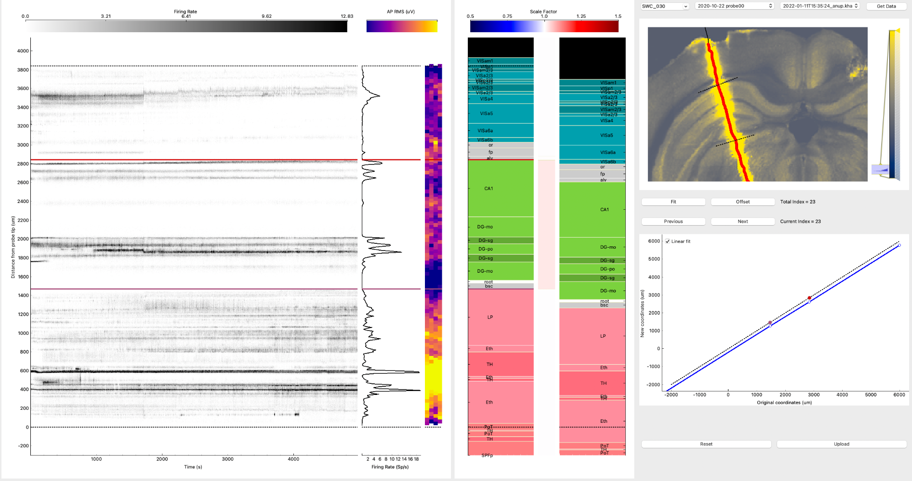
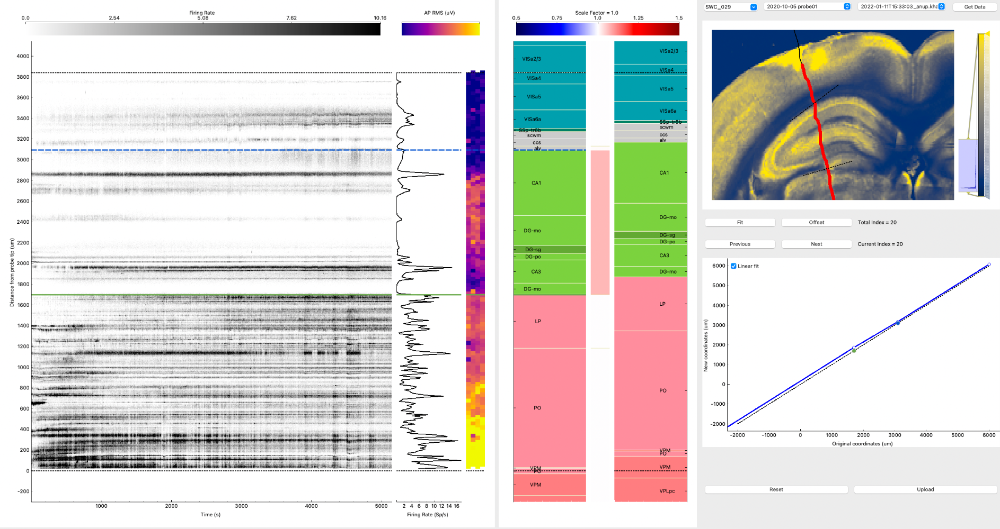
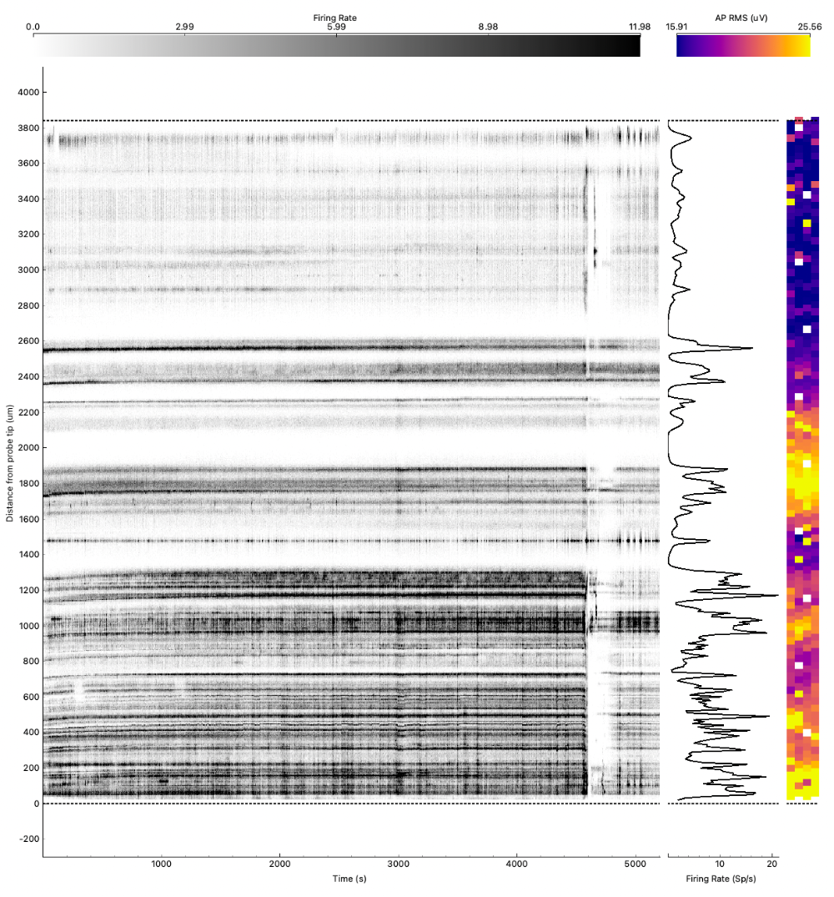
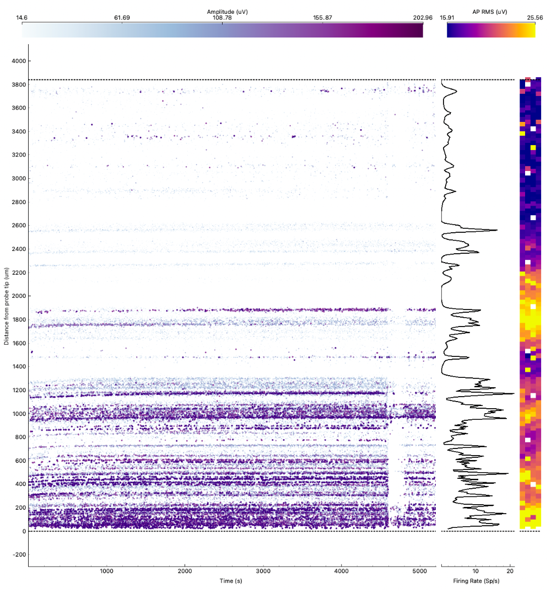
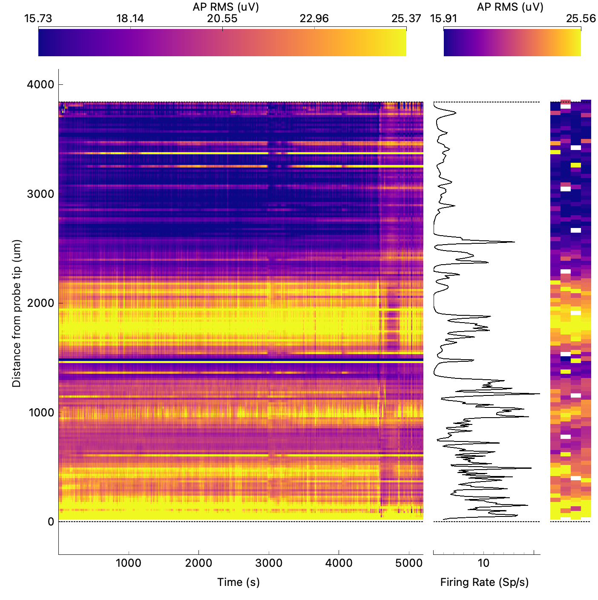

# Of mice and men - Part II: Overall approach to ephys alignments
This post is the second of three parts of my personal reflections  [Of mice and men Or: How I learned to read spikes](https://github.com/sonjafoerster/internshipNL2023/blob/main/00_OMM_Intro.md). The other two parts are:
- How I came to terms with the [IBL ephys alignment GUI](https://github.com/sonjafoerster/internshipNL2023/blob/main/01_OMM_Part_I.md)
- A somewhat more content-focused account of [Common ephys features in the mouse brain (IBL repeated site)](https://github.com/sonjafoerster/internshipNL2023/blob/main/03_OMM_Part_III.md) including my personal logbook of sanity check and handling the IBL ephys GUI.

 

Here, I will give a rather personal account of how I approached my core internship task to do ephys alignments, and the mindset I learned to acquire and embrace throughout this wonderful journey.

 

# Introduction
Doing ephys alignments feels like a treasure hunt to me. Like a puzzle, for which the pieces need to fit and click to eventually comprise this full clear picture. With a slight variation of this metaphor for a beginner in the ephys alignment world: first, identify the pieces which belong to this specific puzzle, to then: click, full clear picture, or - at times - not so full or not so clear picture.
  
Throughout my journey during this internship I learned to follow a few rules which helped me progress towards effective alignments, and I’m happy to share:
- Study the ephys features and histological landmarks - and acknowledge that they still look different in every single recording.
- Do the puzzle back and forth - of dancing and sanity checks. 
- Talk to people who did this before - the power of implicit knowledge, and the beauties of sharing it.

 

# Study the ephys features and histological landmarks - and acknowledge that they still look different in every single recording
Looking at a raster plot of spike rates from a Neuropixels recording for the first time was overwhelming. Yes, sure, the “blacker” the area the more spikes per second recorded at a given position along the probe. But where would be the “pattern” I was supposed to look for? And how would I recognize, or identify this very feature in another recording?
  
So, learning begins. This [introduction lecture](https://www.youtube.com/watch?v=JWzj_vZYr-g&feature=youtu.be "https://(https://www.youtube.com/watch?v=JWzj_vZYr-g&feature=youtu.be") to the tool by Mayo Faulkner was an incredibly helpful starting point. Things, however, were not as straightforward as in the wonderful example Mayo used for her video. Some recordings yield a lot of neural activity, others not so much. Some show clear peaks in firing rate or amplitude at the expected sites, others do not. Sometimes, silent bands are truly silent, in an area as wide as you would expect from looking at the histology plot - but sometimes, there is spiking activity detected right there. Is all of that because the mouse was more or less active, in engaged versus disengaged states most of the time (for an interesting read, see [Ashwood et al.; 2022](https://www.nature.com/articles/s41593-021-01007-z "https://www.nature.com/articles/s41593-021-01007-z")), or could some mice just not see as good (after all, it’s an old mouse)? Or did the probe sometimes poke right through the center of the nuclei, whereas in other recordings, scratched along the edges of some nuclei? And how do other issues with the probe or tissue relate to all of that - from dead reference channels through dried-out saline baths, from probe drift to damaged tissue?

 

_Figure 1. Recording with rather little neural yield in some areas and three not too big FR peaks at upper CA1._ 
_(Source: screenshots from my alignments)_

 

As a beginner, I was on the lookout for these simple relations: high firing rate in cortical visual layers? That must be V5 then. Silent band between thalamic and hippocampal nuclei? That must be the ventral fibre tracts. Hig firing rate at 30-80Hz frequency band - surely, dentate gyrus, granule layer (DG-sg). So, just study the ephys features, know the histological landmarks, identify both in a raster plot - and off you go happily setting reference lines! And it feels good. Simple cause-consequence relationships. Ultimate truth. But wait, why is there another silent band, why is there no, or only little activity at DG-sg, where is this little FR peak in mid-CA1 supposed to be aligned to? And why do I see strong scaling factors in both directions in the same mouse, that is compression of some, stretching of other brain regions?

 

_Figure 2. Recording of another animal than in Figure 1: same side, similar nuclei. Rather high neural yield, also ephys feature in upper CA1 area looks quite different from that in Figure 1. So, is it the same?_ 
_(Source: screenshots from my alignments)_
  

 

The biggest learning for me here was twofold:
1. The truth is not the truth, but the result of many manual and automated steps to record data from a living animal, reduce noise on multiple scales, and sort units according to their overlap in waveform features and their believed distance to the probe (for an excellent overview of challenges and potential signal disturbances in extracellular recordings see [Harris et al.; 2016](https://10.1038/nn.4365 "https://10.1038/nn.4365")). So don’t pretend precision and unambiguity where it might just not be.
2. Do not look for the simple relation, the easy explanation. Acknowledge the difficile and fragile uniquness of each recording, modulated by contextual factors such as, recording from a living individual, relying on imperfect technological wonders - and our ignorance of everything we cannot record (and many things we can record). Go on the treasure hunt to shed light on each recording’s secret, and to identify those elements of the story which are shared across recordings. 
  
To do so, use all the information available, dance back and forth between the plots - and enjoy the puzzle.

 

# Do the puzzle back and forth: of dancing and sanity checks
As I spent more and more time with ephys features, histology landmarks, and the aligments, I learned to embrace the ambiguity. My mindset evolved from looking for the simple relation (implying the illusion of ultimate knowledge and ground truth) to aiming to translate ambiguity into what it actually is: variability of a given phenomenon, unexplained variance, a measure of uncertainty. Thus, the core task of my internship became an intriguing puzzle - and I love to puzzle!
  
The biggested learning her for me was to take the time I need to dive into the puzzle, to identify the critical elements which should click together to reveal the unique story of this very recording. To do so, I learned how crucial it is to verify an assumption across multiple plots, to jump between these different views and information - just as to learn the choreography of a new dance. And to establish sanity checks both those learned from more experienced “aligners” and those evolving from your own routine you develop over time. For example, I usually started with locating the silent bands of the fibre tracts, thus identifying the boundary between thalamic nuclei and dentate gyrus on the ventral side of the probe, and the transition between cortical visual layers and and CA1 on the dorsal side of the probe. However, as DG-mo is, too, rather silent in spike activity, I made it a habit to check for amplitude along with spike rate, and axonal spike waveforms along with perceived changes in firing rate and/or amplitude. I also learned to cross-check on the histology plot where the reference lines would come to sit, and how the probe itself got shifed and scaled (if applicable) in accordance to those early reference lines. It’s never a good sign if the reference line in the histology plot is far off the histology landmark you aim to align. Or if the probe sticks out of the brain a lot - and still seems to record spikes as observed on the spike rate ratser plot.

 

_Figure 3. A noise artifcat (vertical stripe) is clearly visible at ca. 4500s in firing rate plot (left), amplitude plot (middle), and AP RMS plot (right). It might be related to electrical grounding issues, maybe a refill of the saline bath towards the end of the session. (Source: screenshots from my alignments)_

   

 

It can also be extremely useful to know as much as possible about the specific session or recording. So don’t hesitate to check out the session notes, or ask the person who performed the recordings about the routines and habits while working with the animals.
  
Also, be very sure that a feature you consistently observe in a specific recording - across firing rate, amplitude, power spectrum, or spike waveform - truley (or plausibly, at least) is what you think it is before you place the reference line. In other words, and iterating on an idea mentioned earlier: don’t trap yourself in the illusion of precision and unambiguity but instead, accept the fluidity of the recorded signals. Meaning: don’t place too many reference lines which may only lead to implausible scaling factors or reflect a biased worldview. (Again, I can only recommend to read Harris et al. (2016) as it helped me a lot to appreciate the complexity of the matter.)
  
Oh, and allow yourself to grow and learn, thus don’t be afraid to go back to your alignments and do them again, and again, and again - as often as it takes for you to feel comfortable. This is not: go look at other peoples’ alignments and aim to resemble their thinking. Instead, this is: develop your own perspective on this segment of the world and be ready to tell the story of this recording in your own words.
  
Talking about words: It is, however, incredibly helpful to talk to other people, especially those who do alignments longer than you.  

 

# Talk to people who did this before: the power of implicit knowledge, and the beauties of sharing it.
There is nothing like talking to people who know what they do. Crucial information to get started, hints and tricks and tipps to get you up to speed. And then, a while later, you get this opportunity to talk to them again - and it seems like a whole new universe opens up. Part of it is learning on your end, facilitating much deeper understanding of what these experts may have talked about earlier already. But part of it is due to the fact that these experts are humans, too, and that they host this incredibly vast and deep treasure of implicit knowledge. And, as we know, this knowledge treasure is hard to be uncovered explicitely, hence, imiplicit knowledge.   
  
My former me (human factors engineer, UX designer, user-centered-design expert) would advise: observe a lot, listen carefully, ask open-ended questions, dig deeper - always on the lookout for the underlying why, and: iterate. My current me (apprentice in ephys features and alignments) thought that was all a really good idea. There may not be as many experts easily accessible as the ever growing hunger for insights would hope for, but they are there. And they breath the spirit of research, learning, growing. I can only recommend to find them, as the biggest learning for me in this respect was the following: not only did I gain crucial knowledge, not only were these experts’ insights the basis for me to embark on this alignment journey. What is more, they (probably unknowingly) helped me reflect on my own assumptions, develop my own insights, establish my own routines - and critically challenge them before I was set in my ways.
  
 

* * *
# References
- An [introduction lecture](https://www.youtube.com/watch?v=JWzj_vZYr-g&feature=youtu.be "https://(https://www.youtube.com/watch?v=JWzj_vZYr-g&feature=youtu.be") to the tool was given at the [2020 UCL Neuropixels course](https://www.ucl.ac.uk/neuropixels/training/2020-neuropixels-course "https://www.ucl.ac.uk/neuropixels/training/2020-neuropixels-course")
- Paper by Ashwood et al. (2022): [Mice alternate between discrete strategies during perceptual decision-making](https://www.nature.com/articles/s41593-021-01007-z "https://www.nature.com/articles/s41593-021-01007-z")
- Paper by Harris et al. (2016): [Improving data quality in neuronal population recordings](https://www-nature-com.ezproxy.leidenuniv.nl "https://www-nature-com.ezproxy.leidenuniv.nl")