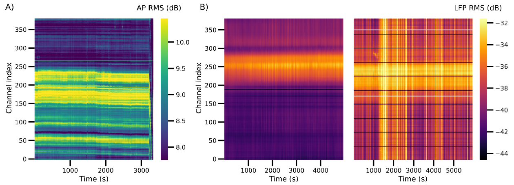
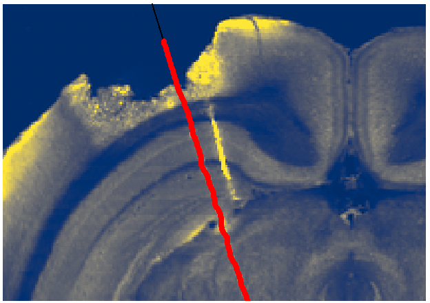
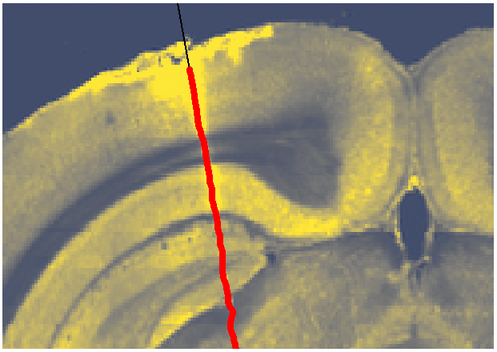
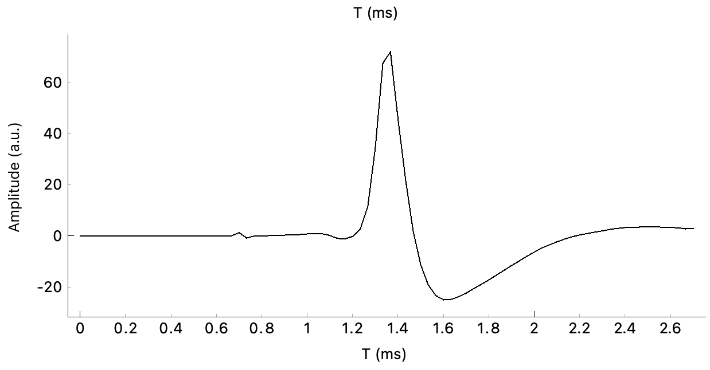
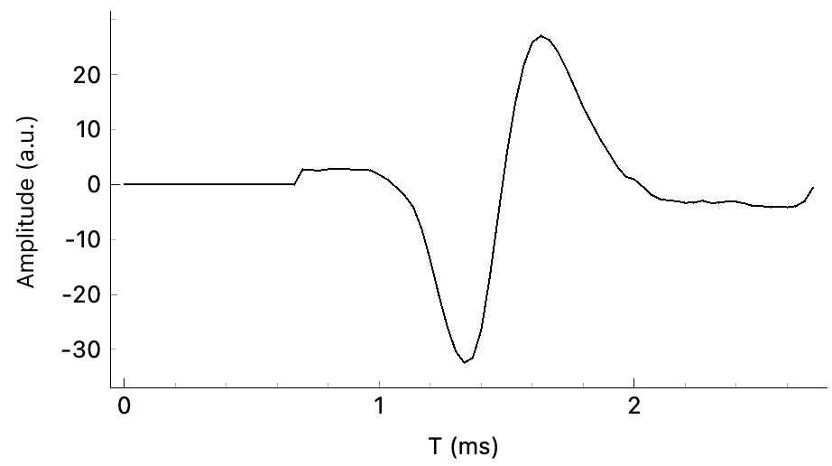

# Of Mice and Men - Part III: Common ephys features in the mouse brain (IBL repeated site)
This post is the third - and last - of three parts of my personal reflections  [Of mice and men Or: How I learned to read spikes](https://github.com/sonjafoerster/internshipNL2023/blob/main/00_OMM_Intro.md). The other two parts are:
- How I came to terms with the [IBL ephys alignment GUI](https://github.com/sonjafoerster/internshipNL2023/blob/main/01_OMM_Part_I.md)
- A personal account of my biggest learnings in the [Overall approach to ephys alignments](https://github.com/sonjafoerster/internshipNL2023/blob/main/02_OMM_Part_II.md)

Here, I will provide a somewhat more content-focused (but surely not comprehensive) account of common ephys features in the mouse brain along the IBL repeated site. I will also share a version of my personal learning logbook (i.e., my insights drawn from experts’ implicit and explicit knowledge, as well as from my personal observations) with regards to sanity checks for my alignments, and notes on software pecularities.

 

# Beware of the ~~dog~~ banana skin: my personal logbook
Over the past few months I’ve had some fights with both my limited knowledge (mostly; it’s called learning, Dude), and the software design (rarely). The following reflects my personal logbook and sanity check reference.
Of great help were for example the [IBL paper on their spike sorting pipeline (IBL, 2022)](https://figshare.com/articles/online_resource/Spike_sorting_pipeline_for_the_International_Brain_Laboratory/19705522/3 "https://figshare.com/articles/online_resource/Spike_sorting_pipeline_for_the_International_Brain_Laboratory/19705522/3") as well as the paper on [accurate localization of linear probe electrodes (Liu et al., 2021)](https://www.eneuro.org/content/8/6/ENEURO.0241-21.2021.long "https://www.eneuro.org/content/8/6/ENEURO.0241-21.2021.long").

 

## Sonja’s sanity check logbook
**What looks like noise artifacts may or may not be actual noise, so assess carefully.** 
- Check e.g., RMS (root mean square) and PSD (power spectral density) plots for horizontal black lines (indicate flat reference channels, or noisy channels which should be excluded) versus vertical stripes (may indicate electrical noise / grounding issues; might occur due to dried-out saline bath, or refilling saline) → Are artifacts along similar locations?
- Is it drift? Assess the patterns. For example, does the whole probe seem to drift or only upper or lower parts? When during session does it start? Short-duration drift at the very beginning or end of a session may indicate that probe was still inserted when recording started, or probe was already extracted before recording stopped, respectively.
- In case of a very noisy recording, check how many units get filtered out when applying the _IBL good_ filter on spike sorting. If many units get filtered out, this may indicate poor recording quality. Also, check unit waveform features from cluster plots → plausible waveform or rather multiunits or “wild oscillations”? Of note: do alignments on unflitered (i.e., all) units.

 

_Figure 1. Assessing recording quality by visually inspecting RMS plots: spatial drift visible (left), good quality with stationary signal within channels (middle). Right plot indicates both flat reference channels (horizontal lines) and electrical noise (vertical lines) (Source: [IBL spike sorting pipeline; 2022](https://figshare.com/articles/online_resource/Spike_sorting_pipeline_for_the_International_Brain_Laboratory/19705522/3 "https://figshare.com/articles/online_resource/Spike_sorting_pipeline_for_the_International_Brain_Laboratory/19705522/3"))_

 

**Tissue damage - or not?**

Another source of noise could be related to tissue damage. Check histology plot to see if severe tissue damage is visible and may have disturbed the signal. Of note, though: the tissue slice can only reflect the damage as it appeared at the time of the animal’s death. Thus, earlier recordings may not have been impacted by the later tissue damage at all (and some damage may only have occured while preparing the slices). So check whether the session to be aligned was among the earlier or later recordings of that animal. 

 

_Figure 2. Severe tissue damage, and later recording in that animal’s life (see remainder of previous probe trace, yellow stripe right of current LASAGNA interpolation (left) versus little damage (probably inflamation which may not impact recording quality; right) (Source: screenshots from my alignments)_

 

 

**No “true” silence in silent bands, and silence where there should be activity**
- White matter fibres such as corpus callosum (e.g., alv, or, fp in Allen atlas notation) are expected to be silent - overall. However, there may be spikes detectable on the firing rate and/or amplitude raster plots. Those should then be axonal spikes with flipped polarity → check spike waveform on cluster plots.
- Typical silent bands with little firing activity (i.e., low firing rate) are the molecular layers of the dentate gyrus (DG-mo). Depending on probe location and probe angle, in the repeated site recordings they often “sandwich” the granule layers of dentate gyrus (DG-sg), which is characterized by high firing rate at the 30-80 Hz power band.
- The most dorsal visual layers of cortex may die out due to damage, drying-out, or other reasons for neurodegeneration. Thus, even so activity would be expected in visual cortex layers, there may be no activity detectable in such cases. If silence occurs at upper recording channels, check whether channels sticks out of the brain due to probe position and/or tissue damage (thus, silence is plausible) or whether channel position would suggest spike activity (thus, silence may indicate dead tissue).
- If it seems hard to detect boundaries of silent areas / fibre tracts, check the correlation plot: reference lines should be aligned with the boundaries between correlated and non-correlated pixels (”negative space”).

 

_Figure 3. Example of axonal spike with flipped polarity waveform (left) versus examples of typical spike waveform (right). (Source: Screenshots from my alignments)_

  

 

**Scaling**

In contrast to purely offsetting the probe (i.e., shifting it up or down to align with the reference), scaling indicates the difference in physical brain size between the particular mouse of this very recording and the average Allan atlas mouse (which is an average across 1600 mice). While it can happen that brain regions are differently expressed in different mice, size of brain regions within one mouse are likely relative to the overall physical size of their brain. Thus, it is rather unlikely that there would be a lot of both stretching and compression on different (adjacent) brain regions within one animal. It is more likely to encounter an overall larger or overall smaller brain (compared to the average image), which would lead to an overall compression or overall stretching upon the alignment, respectively. Thus, if your alignment suggests both stretched and compressed scaling, go back and sanity check carefully.
There is one more aspect to consider: Often, one animal performs multiple sessions, so there are multiple recordings from one animal (with potentially different probe trajectories). As it is the same animal, though, chances are that the animal's brain pertained its overall size. This means, that alignments across sessions from this very animal should result in a somewhat similar scaling factor. Sounds reasonable? Check the _Scaling factors for this animal_.

 

**Same same but different - same region / nuclei, but different spike patterns.**

The angle of the probe trajectory matters a lot when assessing similarity in spike patterns and morphological features across sessions and animals: Even if, by enlarge, the probe poked through the same overall regions, the angle of the trajectory may lead the probe to run through different subnuclei, or scratch along the edge versus the center of a nucleus. Not only can that reveal quite different features, it also emphasizes the relevance of focus: be sensitive to the periphery; do not expect the features to indicate the center of a nucleus.

 

## Some minor flaws I encountered in the GUI
The [IBL ephys alignmen GUI](https://github.com/sonjafoerster/internshipNL2023/blob/main/01_OMM_Part_I.md) is a well thought through and robustly implemented tool to manually align ephys features to histology landmarks and visually check the quality of the recordings. What is more, a dedicated team of extremly skilled experts continues to dilligently work on and improve the tool. For example, at some point, I experienced that I was not able to obtain the unit feature popups from the cluster plots. So I [filed a ticket here](https://github.com/int-brain-lab/iblapps/issues "https://github.com/int-brain-lab/iblapps/issues"), and within a day or two the problem was fixed. This truly is an impressive turnaround time!
  
There are, however, some minor flaws in the GUI which may be helpful to know if you are about to get familiar with the tool (did I mention that my former me worked as an UX designer...?):

 

### Colored reference lines: make sure you move the intended one
Presumably to better differentiate between them, reference lines are colored. Till now, however, I was not able to determine the particular order of colors, nor whether there might be any other reason for the colors. And yes, it does not really matter as of my current state of knowledge. What is a little challenging at times, though, is that some colors are very much the same as some of the colors in the histology map, for example the ligth green of some CA1 and some of the DG nuclei, making it really hard to spot the line once generated. Thus, be always sure which reference line you move - and whether it is the intended one. To me, moving the wrong (unitended) reference line on the histology map happened especially when I set multiple reference lines before hitting the _Fit_ button, i.e., before the map was shifted / scaled.

 

### Hard to retrieve the very same unit feature popup again
Upon clicking on a dot in the cluster plots, a unit feature overview would pop up. While the clusters are numbered on this popup, there seems no option available to retrieve a specific feature popup. It would be great to e.g., show the cluster number when hovering over a cluster point, or to have a functionality which allows to search for a specific cluster number. Also, it would be great to see which popup belongs to which dot in the cluster plot, e.g., through a line or callout-like design of the popup.

 

### Colors to indicate scaling factors: red = stretched, blue = compressed
The coloring of the scaling factors might seem counter-intuitive, at least it did so for me as an ephys newbie. There might be a convention in the field, or I might be biased from conventions in other fields, so pardon my ignorance. But, I confused stretched and compressed scaling so many times because to me it feels intuitive to indicate comressing factors with red, while I associate stretching factors with blue. Not a big deal, of course, but I was grateful for the second coding: the numbers provided on the scale.
  
 

* * *
# References
- IBL (2022): [Spike sorting pipeline for the International Brain Laboratory](https://figshare.com/articles/online_resource/Spike_sorting_pipeline_for_the_International_Brain_Laboratory/19705522/3 "https://figshare.com/articles/online_resource/Spike_sorting_pipeline_for_the_International_Brain_Laboratory/19705522/3")
- Liu et al (2021): [Accurate Localization of Linear Probe Electrode Arrays across Multiple Brains](https://www.eneuro.org/content/8/6/ENEURO.0241-21.2021.long "https://www.eneuro.org/content/8/6/ENEURO.0241-21.2021.long")
- IBL [user guide](https://github.com/int-brain-lab/iblapps/wiki/2.-Usage-instructions "https://github.com/int-brain-lab/iblapps/wiki/2.-Usage-instructions") to the ephys alignment GUI
- IBL issues to reported in [iblapps github](https://github.com/int-brain-lab/iblapps/issues "https://github.com/int-brain-lab/iblapps/issues")
